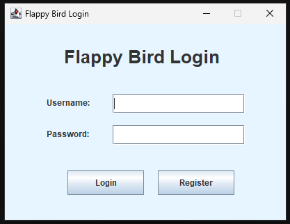
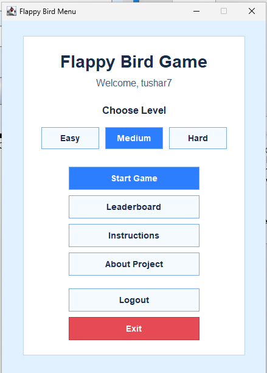
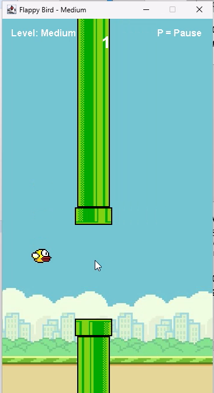
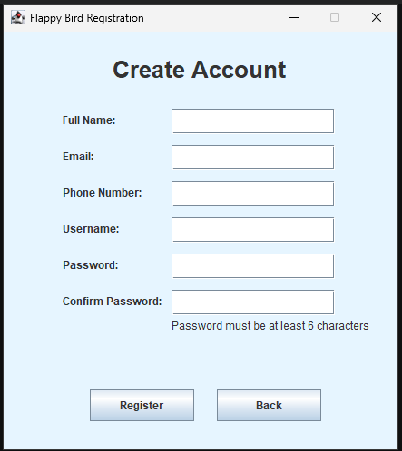
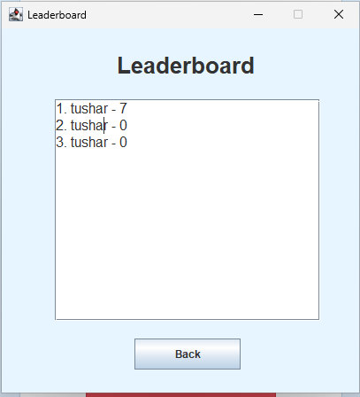

# 🐦 Flappy Bird — Java Swing Edition

A fully featured desktop Flappy Bird game built with Java Swing and AWT. This isn't just a basic clone — it comes with a complete user authentication system, three difficulty levels, a file-based leaderboard, and a bunch of quality-of-life features that make it feel like a real polished application.

---

## 📖 About the Project

This project started as a way to practice Object-Oriented Programming concepts in Java, and it kind of grew from there. What began as a simple game loop turned into a full desktop application with login/registration, score tracking, difficulty selection, and even sound feedback.

The game logic uses a `Timer`-driven game loop with `KeyListener` for controls, and all user and score data is stored in plain text files — no database needed to get it running.

---

## ✨ Features

**User System**
- Registration with full validation (email format, 11-digit phone, password length, confirm password matching)
- Secure login with credential checking
- File-based user storage (`users.txt`)
- Logout and exit confirmation dialogs

**Gameplay**
- Classic Flappy Bird mechanics — gravity, jump, moving pipes, random gaps
- Three difficulty levels: Easy, Medium, and Hard (affects pipe speed, gap size, and spawn rate)
- Collision detection and game over screen
- Pause and resume mid-game
- Restart without going back to the menu
- Score counter during gameplay

**Leaderboard**
- Top scores saved to `scores.txt` after each session
- Leaderboard screen accessible from the main menu
- Scores tied to registered usernames

**Other**
- Instructions screen
- About page
- Sound toggle (on/off)
- Clean main menu with all navigation options

---

## 🛠️ Technologies Used

| Technology | Purpose |
|---|---|
| Java | Core programming language |
| Java Swing & AWT | GUI framework |
| Java File I/O | Data persistence (users & scores) |
| Java Sound API | Beep/sound feedback |
| OOP (Java) | Architecture and design |

---

## 📂 Project Structure

```
FlappyBird_Game/
│
├── src/
│   ├── App.java                  # Entry point — launches LoginFrame
│   ├── LoginFrame.java           # Login window and authentication
│   ├── RegisterFrame.java        # Registration with input validation
│   ├── MenuFrame.java            # Main menu with all navigation options
│   ├── InstructionsFrame.java    # Game controls and how-to-play screen
│   ├── AboutFrame.java           # Project info and developer details
│   │
│   ├── FlappyBird.java           # Core game panel — loop, drawing, physics
│   ├── GameObject.java           # Abstract base class for game objects
│   ├── Bird.java                 # Player bird with gravity and jump logic
│   ├── Pipe.java                 # Pipe objects with scoring logic
│   │
│   ├── User.java                 # User data model
│   ├── UserManager.java          # Registration, login, and file handling
│   ├── ScoreManager.java         # Score saving, loading, and leaderboard sorting
│   ├── LeaderboardFrame.java     # Leaderboard display window
│   ├── SoundManager.java         # Sound toggle and beep management
│   │
│   ├── flappybird.png            # Bird image asset
│   ├── flappybirdbg.png          # Background image
│   ├── toppipe.png               # Top pipe image
│   ├── bottompipe.png            # Bottom pipe image
│   │
│   ├── users.txt                 # Registered user data (auto-generated)
│   └── scores.txt                # Saved scores (auto-generated)
```

---

## 🚀 How to Run

### Prerequisites
- Java JDK 17 or later
- Windows OS (tested on Windows; behavior on other OS may vary)

### Option 1 — Easy Way (Windows)
Double-click `run.bat` in the project folder.

### Option 2 — Manual Compile and Run

**Step 1: Compile all source files**
```bash
javac -d bin src\App.java src\User.java src\UserManager.java src\LoginFrame.java src\RegisterFrame.java src\MenuFrame.java src\InstructionsFrame.java src\AboutFrame.java src\GameObject.java src\Bird.java src\Pipe.java src\FlappyBird.java src\ScoreManager.java src\LeaderboardFrame.java src\SoundManager.java
```

**Step 2: Run the application**
```bash
java -cp bin App
```

### Option 3 — Using an IDE
Import the `src/` folder into VS Code, IntelliJ IDEA, or Eclipse and run `App.java` directly.

---

## 🎮 Controls

| Key | Action |
|---|---|
| `SPACE` | Jump |
| `P` | Pause / Resume |
| `R` | Restart after game over |
| `ESC` | Back to menu |

---

## 📝 How to Play

1. **Register** — Create an account with your full name, email, phone number, username, and password
2. **Login** — Sign in with your credentials
3. **Select Difficulty** — Choose Easy, Medium, or Hard from the main menu
4. **Play** — Press `SPACE` to jump and navigate through the pipes
5. **Check the Leaderboard** — See where your score ranks after the game ends

---

## 🏗️ OOP Design

The project follows core Object-Oriented Programming principles throughout:

**Encapsulation** — `User`, `Bird`, and `ScoreManager` all keep their internal data private and expose only what's needed through getters and setters.

**Inheritance** — All GUI windows (`LoginFrame`, `RegisterFrame`, `MenuFrame`, etc.) extend `JFrame`. `FlappyBird` extends `JPanel`. `Bird` and `Pipe` both extend `GameObject`.

**Polymorphism** — `paintComponent` is overridden for custom game rendering. `actionPerformed` handles both button clicks and the game loop timer. `keyPressed` handles all keyboard input through `KeyListener`.

**Abstraction** — `UserManager` and `ScoreManager` hide all the file I/O logic behind clean method calls. GUI classes each handle their own screen independently.

---

## ⚠️ Known Limitations

- Scores are stored locally in a text file — no online leaderboard
- Graphics are simple static assets; no animations
- No sound volume control, only on/off toggle
- Single gameplay mode only (no multiplayer or alternate challenges)
- Testing was done primarily on Windows; cross-platform behavior is not guaranteed

---

## 🔮 Possible Future Improvements

- Replace text file storage with a proper database (MySQL or SQLite)
- Online leaderboard with cloud-based score sharing
- Better graphics and smoother animations
- Multiple game modes (endless, time attack, etc.)
- User profile management and statistics
- Android or web version
- AI-based adaptive difficulty
- Auto-backup for score data

---

## 📜 License

This project was built for academic and learning purposes.

---

## 📸 Screenshots

> Add your screenshots inside a `screenshots/` folder in your repo, then they'll show up here automatically.

| Login Screen | Main Menu | Gameplay |
|---|---|---|
|  |  |  |

| Registration | Leaderboard |
|---|---|
|  |  |

---

## 👨‍💻 Author

**Shihab Uddin**
Computer Science and Engineering Student

GitHub: [@Shihab7s2](https://github.com/Shihab7s2)
